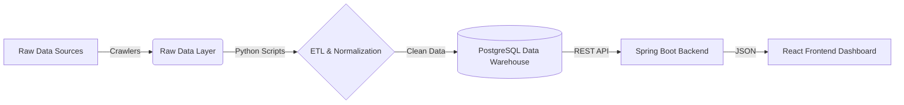

# IT Job Market Analyzer (Vietnam & Japan) 🇻🇳 🇯🇵

A comprehensive data-driven system designed to collect, normalize, analyze, and visualize IT recruitment data from the Vietnamese and Japanese markets. This tool helps developers and recruiters make data-informed decisions by providing insights into salary trends, in-demand skills, and emerging technologies.

## 🌟 Key Features

* **Multi-Source Data Collection**: Automated crawling and ingestion of IT job postings from public sources.
* **Intelligent Normalization**:
* **Skill Extraction**: Maps variations (e.g., "ReactJS", "React.js") to standardized skill entities.
* **Salary Standardization**: Converts diverse salary formats (JPY/USD/VND, Gross/Net) into a unified currency for accurate comparison.


* **Advanced Analytics**:
* Skill popularity trends over time.
* Cross-border salary comparison (Vietnam vs. Japan) adjusted for exchange rates.
* Skill gap analysis for career planning.


* **Interactive Dashboard**: Real-time visualization of market data using React.

## 🏗 High-Level Architecture

The system follows a modern Data Pipeline architecture:



## 🛠 Tech Stack

| Component | Technology | Description |
| --- | --- | --- |
| **Data Processing** | Python | Pandas, BeautifulSoup/Selenium for crawling & cleaning. |
| **Database** | PostgreSQL | Relational storage with JSONB support for raw data. |
| **Backend** | Java Spring Boot | RESTful API, Security (JWT), Data JPA. |
| **Frontend** | ReactJS | Interactive dashboard with Charts (Recharts/Chart.js). |
| **Build Tool** | Gradle | Dependency management for Backend. |

## 📂 Project Structure

```bash
it-job-analyzer/
├── backend/            # Spring Boot Application (API Core)
├── frontend/           # ReactJS Application (Dashboard UI)
├── data/               # Data storage
│   ├── raw/            # Raw CSV/JSON files from crawlers
│   └── processed/      # Cleaned datasets ready for import
├── scripts/            # Python scripts for ETL and Crawling
└── docs/               # Project documentation & ERD diagrams

```

## 🚀 Getting Started

### Prerequisites

* Java JDK 17+
* Node.js & npm/yarn
* PostgreSQL 14+
* Python 3.8+

### Installation & Run Guide

#### 1. Database Setup

Create a PostgreSQL database and configure the connection in `backend/src/main/resources/application.properties`.

#### 2. Data Ingestion (ETL)

Place your raw crawler data (CSV) into `data/raw` and run the processing scripts:

```bash
cd scripts
pip install -r requirements.txt
python process_data.py

```

#### 3. Backend (API)

Navigate to the backend directory and start the Spring Boot server:

```bash
cd backend
./gradlew bootRun

```

*Server will start at: `http://localhost:1010*`

#### 4. Frontend (Dashboard)

Navigate to the frontend directory and start the React application:

```bash
cd frontend
npm install
npm run dev

```

*Dashboard will launch at: `http://localhost:3000*`

## 📊 Database Schema (Simplified)

* **`raw_jobs`**: Staging area for raw crawler data (JSONB).
* **`jobs`**: Normalized job postings.
* **`skills`**: Standardized list of IT skills.
* **`job_skills`**: Many-to-Many relationship mapping jobs to skills.

## 👥 Contributors

* **Lương Thế Nguyên** - *Data Engineer & Backend Logic*
* **Hùng Vũ Long** - *Fullstack Developer & System Architect*

## 📝 License

This project is licensed under the MIT License - see the [LICENSE](https://www.google.com/search?q=LICENSE) file for details.
=======
# IT Job Market Analyzer (Vietnam & Japan)

A data-driven system for collecting, normalizing, analyzing, and visualizing IT job market data in Vietnam and Japan.

## Objectives
- Collect IT job postings from public sources
- Normalize skills, level, location
- Store data in PostgreSQL
- Provide analytics via REST API
- Visualize insights through dashboard

## Tech Stack
- Python (data processing)
- Spring Boot (Gradle)
- PostgreSQL
- React

## High-level Architecture
Raw Data -> Cleaning -> Normalization -> Database -> Backend API -> Frontend Dashboard

## Project Structure
/docs        -> documentation  
/data        -> datasets  
/scripts     -> data processing scripts  
/backend     -> Spring Boot application  
/frontend    -> React dashboard  

## How to Run
1. Put raw CSV files into data/raw
2. Run scripts in scripts/
3. Start backend
4. Start frontend
